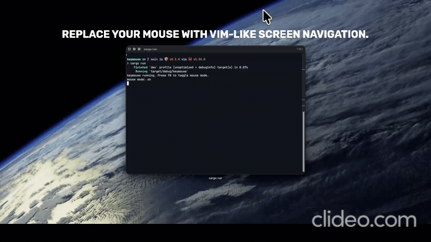

# Keymouse

Control your mouse on macOS with fast, Vim-style keyboard navigation.



*Demo: toggling mouse mode, moving with `H J K L`, clicking, and jumping the cursor with the grid system.*

## Features

- Global keyboard-driven mouse control on macOS (`CGEventTap`)
- Toggleable mouse mode (`F8`) so normal typing is unaffected when off
- Cursor movement with configurable keys (defaults: `H J K L`)
- Speed modifiers for movement/scroll (defaults: `Shift` fast, `Option/Alt` slow)
- Scroll control with configurable keys (defaults: `U N B M`)
- Left/right click from keyboard (defaults: `F` / `D`)
- Recursive 3x3 jump grid with translucent overlay and depth indicator
- Multi-monitor aware grid targeting on the display under the cursor
- Automatic event-tap re-enable if macOS temporarily disables the tap

## Installation

### Option 1: Install from crates.io (recommended)

```bash
cargo install keymouse
```

Run it:

```bash
keymouse
```

### Option 2: Download a prebuilt binary from GitHub Releases

Latest release:

- https://github.com/debacodes10/keymouse/releases/latest

Example (Apple Silicon / arm64):

```bash
curl -L -o keymouse-macos-arm64.zip https://github.com/debacodes10/keymouse/releases/latest/download/keymouse-macos-arm64.zip
unzip keymouse-macos-arm64.zip
chmod +x keymouse-macos-arm64
./keymouse-macos-arm64
```

### Option 3: Build from source

Clone the repository:

```bash
git clone https://github.com/debacodes10/keymouse.git
cd keymouse
```

Build a release binary:

```bash
cargo build --release
```

The compiled binary will be available at:

```bash
target/release/keymouse
```

## Usage

### 1) Start Keymouse

```bash
keymouse
```

If you built from source:

```bash
./target/release/keymouse
```

### 2) Grant macOS permissions

Grant permissions to the app that launches Keymouse (usually Terminal/iTerm):

- `System Settings` -> `Privacy & Security` -> `Accessibility`
- `System Settings` -> `Privacy & Security` -> `Input Monitoring`

### 3) Toggle mouse mode

- Press `F8` to turn mouse mode on/off.
- When mouse mode is **off**, all keys behave normally.
- When mouse mode is **on**, keydown/keyup events are intercepted by Keymouse.

### 4) Control the pointer

- Move: `H J K L`
- Scroll: `U N B M`
- Click: `F` (left), `D` (right)
- Modifiers: `Shift` = fast, `Option/Alt` = slow

### 5) Use jump grid mode

- Press `;` (default `grid_key`) to show the 3x3 grid on the display under the cursor.
- Select cells with `Q/W/E`, `A/S/D`, `Z/X/C` to zoom recursively.
- Optional alternates in grid mode: `F` maps to middle-left, `G` maps to center.
- Press `Enter` to move cursor to the selected region center.
- Press `Esc` to cancel grid mode.

### Default keymap

| Key | Action |
| --- | --- |
| `F8` | Toggle mouse mode |
| `H J K L` | Move cursor |
| `Shift` + move/scroll keys | Fast movement/scroll |
| `Option` + move/scroll keys | Slow movement/scroll |
| `U N B M` | Scroll up/down/left/right |
| `F` | Left click |
| `D` | Right click |
| `;` | Enter grid mode |
| `Q/W/E/A/S/D/Z/X/C` | Select grid cell recursively |
| `Enter` | Confirm grid jump |
| `Esc` | Cancel grid mode |

### Quit

Use `Ctrl+C` in the terminal running Keymouse.

## Configuration

Keymouse loads configuration from:

```text
~/.config/keymouse/config.toml
```

If the file is missing, Keymouse uses built-in defaults. At startup, it also writes an example file to that path so you can customize bindings.

Example `config.toml`:

```toml
movement_up = "k"
movement_down = "j"
movement_left = "h"
movement_right = "l"

scroll_up = "u"
scroll_down = "n"
scroll_left = "b"
scroll_right = "m"

grid_key = ";"
confirm_key = "enter"

left_click = "f"
right_click = "d"

fast_modifier = "shift"
slow_modifier = "option"
```

Supported key names for bindings are currently:

- Letters used by default (`a b c d e f g h j k l m n q s u w x z`)
- `;` (or `"semicolon"`), `"enter"`/`"return"`, `"escape"`/`"esc"`, `"f8"`
- Modifiers: `"shift"` and `"option"`/`"alt"` (for modifier fields)

Unknown key names fall back to default values.

## Troubleshooting

- If Keymouse exits with an event tap error, re-check Accessibility and Input Monitoring permissions for the launching app.
- If keyboard control stops after long inactivity or heavy system load, macOS may have disabled the tap; Keymouse now attempts to re-enable it automatically.

## Roadmap

- [x] Vim-style cursor movement
- [x] Grid jump navigation
- [x] Multi-monitor support
- [x] Recursive grid zoom
- [x] Custom key bindings
- [x] Configuration file
- [ ] Homebrew installation

## Contributing

Contributions, suggestions, and feature requests are welcome. Open an issue to discuss ideas, or submit a pull request with a focused change.

## License

MIT. See [`LICENSE`](LICENSE).
