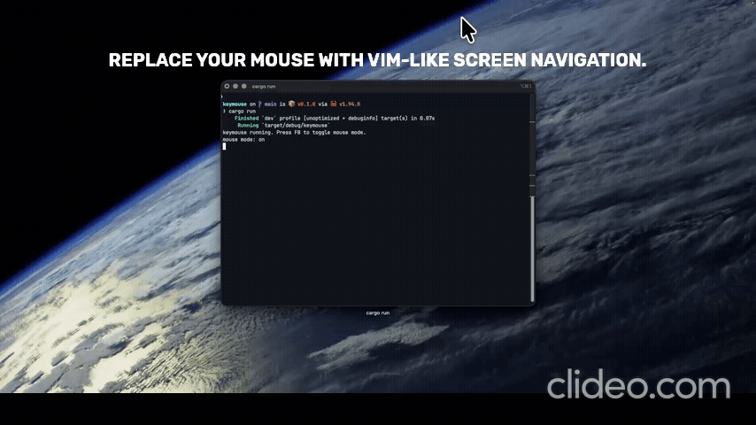

# Keymouse

Keyboard-driven mouse control for **macOS** and **Windows** with Vim-style navigation.



## Platform Support

- **macOS**: fully supported (menu bar app, start at login, app bundle install)
- **Windows**: supported runtime for keyboard mouse control and grid overlay (CLI/headless mode)

## Features

- Global keyboard hook for mouse control
- Toggleable mouse mode (`toggle_key`, default `F8`)
- Move cursor with configurable keys (default `H J K L`)
- Scroll with configurable keys (default `U N B M`)
- Left/right click and drag toggle from keyboard
- Recursive 3x3 jump grid with remappable selection keys and monitor switching (`1..9`)
- Configurable key bindings and modifiers
- Configurable grid visuals (`theme`, `opacity`, `color`, `labels`)
- Optional HUD overlay showing mode, recent action, and optional ignored-key hints

macOS-only extras:

- Menu bar app (`KM`)
- Start-at-login toggle from menu bar
- `--install-app` / `--uninstall-app` app bundle workflow

## Installation

### Option A: Install with Cargo

Requires Rust toolchain (`cargo`) installed.

```bash
cargo install keymouse
```

Run:

```bash
keymouse
```

On macOS, this starts the menu bar app by default.
On Windows, this starts the runtime in headless mode by default.

### Option B: Build Standalone Binary from Source

Clone and build:

```bash
git clone https://github.com/debacodes10/keymouse.git
cd keymouse
cargo build --release
```

Output binaries:

- macOS: `target/release/keymouse`
- Windows: `target\\release\\keymouse.exe`

Run directly:

```bash
# macOS
./target/release/keymouse
```

```powershell
# Windows
.\target\release\keymouse.exe
```

### Option C: Use Prebuilt Release Assets

Download from:

- [GitHub Releases](https://github.com/debacodes10/keymouse/releases)

Unzip and run the binary for your OS/arch.

## Building on Windows (Important)

### 1) Install native build tools

Use **Visual Studio Build Tools 2022** with:

- Desktop development with C++
- MSVC v143 toolchain
- Windows 10/11 SDK

Then build from **Developer Command Prompt** or any shell where these exist:

```powershell
where cl
where link
```

### 2) App Control / WDAC environments

If Windows policy blocks Cargo build scripts (common under `Downloads`), use a trusted path:

- Move repo to `C:\dev\keymouse`
- Use trusted target dir, e.g. `C:\dev\cargo-target\keymouse`

```powershell
setx CARGO_TARGET_DIR C:\dev\cargo-target\keymouse
```

Open a new terminal after `setx`.

## Usage

### Start

```bash
keymouse
```

Or from source:

```bash
cargo run --release
```

### Main controls (default)

- `F8`: toggle mouse mode
- `H J K L`: move cursor
- `Shift`: fast movement/scroll
- `Option/Alt`: slow movement/scroll
- `U N B M`: scroll up/down/left/right
- `F`: left click
- `D`: right click
- `V`: toggle drag hold

### Grid mode

- `;`: open grid on active display
- `1..9`: switch monitor while grid is active
- Configured `grid_selection_keys`: zoom into cell
- `Enter`: confirm jump
- `Esc`: cancel grid

### CLI commands

Cross-platform:

- `--headless`
- `--check-config`
- `--help`

macOS-only:

- `--install-app`
- `--uninstall-app`
- `--start`
- `--stop`
- `--restart`

## macOS Setup

### Permissions

Grant permissions to the app that launches Keymouse:

- System Settings -> Privacy & Security -> Accessibility
- System Settings -> Privacy & Security -> Input Monitoring

If launched from terminal, grant Terminal/iTerm.
If launched from app bundle, grant `Keymouse.app`.

### App bundle workflow

```bash
keymouse --install-app
```

Launch from Spotlight (`Keymouse`) or `~/Applications/Keymouse.app`.

Remove bundle:

```bash
keymouse --uninstall-app
```

## Configuration

Keymouse loads `config.toml` from OS config directory:

- macOS: `~/Library/Application Support/keymouse/config.toml`
- Windows: `%APPDATA%\\keymouse\\config.toml`

If missing, defaults are used and an example file is written.

Example:

```toml
toggle_key = "f8"

movement_up = "k"
movement_down = "j"
movement_left = "h"
movement_right = "l"

scroll_up = "u"
scroll_down = "n"
scroll_left = "b"
scroll_right = "m"

grid_key = ";"
grid_selection_keys = ["q", "w", "e", "a", "s", "d", "z", "x", "c"]
confirm_key = "enter"

left_click = "f"
right_click = "d"
drag_toggle = "v"

fast_modifier = "shift"
slow_modifier = "option"

grid_theme = "classic"
grid_opacity = 1.0
grid_color = "#4fd1ff"
# Optional: override what the grid shows on screen.
# If omitted, labels follow `grid_selection_keys`.
# grid_labels = ["Q", "W", "E", "A", "S", "D", "Z", "X", "C"]

# HUD overlay
hud_enabled = true
hud_show_last_action = true
hud_unknown_key_hint = false
hud_opacity = 0.9
hud_position = "top_right"
```

Supported key names include:

- letters used by defaults (`a b c d e f g h j k l m n q s u v w x z`)
- `;` / `semicolon`, `enter`, `return`, `escape`, `esc`
- `f1` ... `f12`
- modifiers: `shift`, `option`, `alt`

`grid_selection_keys` must contain exactly 9 unique supported keys. They cannot reuse `toggle_key`, `grid_key`, or `confirm_key`.

HUD settings:
- `hud_enabled`: show mode/status HUD while mouse mode is enabled
- `hud_show_last_action`: show a short-lived last action line
- `hud_unknown_key_hint`: optional ignored-key hint for non-configured keys in mouse mode
- `hud_opacity`: `0.0` to `1.0`
- `hud_position`: `top_left`, `top_right`, `bottom_left`, or `bottom_right`

## Troubleshooting

- macOS event tap failure: re-check Accessibility/Input Monitoring permissions.
- Windows `link.exe` / `cl.exe` not found: install VS Build Tools + MSVC toolchain.
- Windows build blocked by policy (`os error 4551`): build from trusted path and set `CARGO_TARGET_DIR`.

## Contributing

Contributions and focused PRs are welcome.

## License

MIT. See [`LICENSE`](LICENSE).
